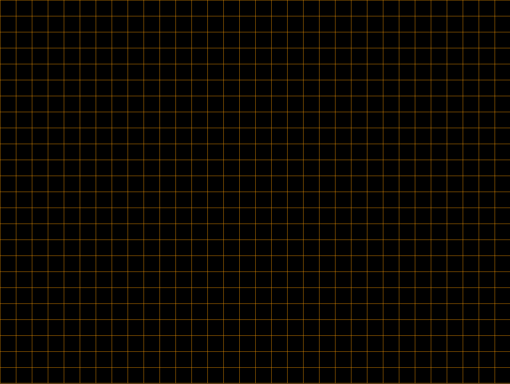

# Collector

AP CSP Senior Project. Learning SDL in C++ independently.

## Controls
1. Left Mouse
   
   <small>
   a. Auto Zoom in Rectangles
   
   b. Single Pixel Draw Tool in Cursor Modes
   
   c. Accelerates Game Speed for Conway's Game of Life modes
   </small>
   
2. Right Mouse

   <small>
   a. Auto Zoom in Rectangles (other direction)

   b. Cross Hair Draw Tool in Cursor Modes
   
   c. Deccelerates Game Speed for Conway's Game of Life modes
   </small>

3. Middle Mouse

   <small>
   a. Toggles Memory Clear
   </small>
4. Console Inputs
   
    <small>You may be prompted to enter parameters for certain modes</small>
    <small>
   
    a. Density or Grid Size
    
   - Grid Size represents the size of each grid square and Density represents the average distance between "Live" pixels in a given row. In either, greater input will result in sparser pixel placement.
   
    b. Seed
   
     - Any positive integer, this is used for deterministically seeding pixels 
   </small>
   
   ## Program Output Samples
#### 1.      Solid Color
Creates a window which continuosly cycles through hues.

#### 2.      Grid
Creates a grid which can be zoomed in and out of using *left* and *right click* respectively. The grid's color cycles similarly to "Solid Color."

#### 3.      Cursor

Creates a blank canvas which can be painted with cursor using *left click* and with a cross-brush using *right click*. Paint tools are activated through toggling. The user may also toggle painting on or off with the *middle mouse button*.

#### 4.      Cursor Filled

This improves on "Cursor" by filling in gaps between cursor location gaps. This results in connected lines instead of groups of dots as well as a smoother strokes with the cross-brush tool. Controls are identical as "Cursor."

#### 5.      Game of Life
Creates a board randomly populated with white cells that are either 'Alive' ordark cells that are 'Dead.' The cells then spontaneusly 'Die' or become 'Alive' according to the rules of John Conway's Game of Life.

#### 6.      Game of Life (Seed & Density)
Acts the same as "Game of Life," but the initial state can be generated from "Seed" and "Density" parameter inputs. In either program the final result consists of either static or cyclical groups of cells akin to a 'Starry Sky.'

#### 7.      Growth Random
Similar to the "Game of Life," this program starts with random "Live" and "Dead" cells. However, in this program cells never die. Instead the cells continously multiply around random nucleation points, areas with a sufficiently high concentration of live cells, until the entire window is filled.

#### 8.      Growth (Seed & Density)
Acts similarly to "Growth Random," but the initial state is generated from "Seed" and "Density" parameter inputs. In either program the final result consists of a filled window as growth areas merge and multiply.

